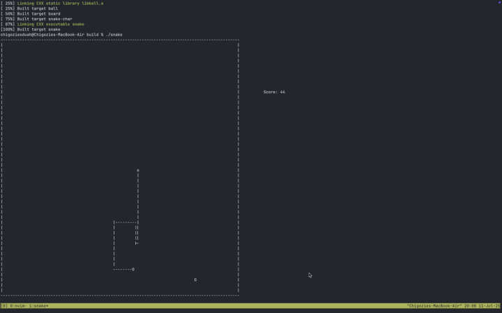

# Snake game

A snake game that runs in the terminal.


## Requirements

- C++ 20+ compiler
- CMake 4.0+
- make

## Running the game

To run the game on your local system, follow these steps:
- Clone the repository:
```bash
git clone https://github.com/GhoulKingR/snake
```
- **Cd** into the project directory:
```bash
cd snake
```
- Create a new `build` folder and **cd** into it:
```bash
mkdir build
cd build
```
- Compile the project:
```bash
cmake ..
make
```
- Run the game:
```bash
./snake
```

# Controlling the snake

In this game you can control the snake's direction using the `WASD` key-binding or, if you want vim key-bindings `hjkl`.
